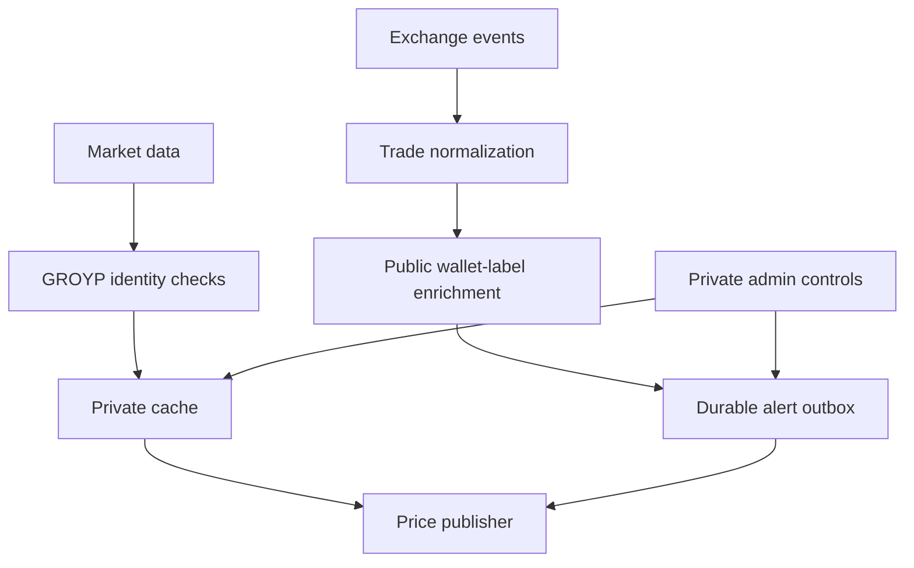

# Architecture

Wallet labels are presentation enrichment, not an authorization source. Publication and alert delivery remain separate recovery domains. Exact providers, addresses, and state formats are omitted.
